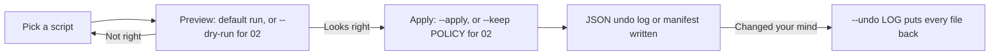

# python-automation-toolbox

20 standalone Python scripts that automate the boring parts of using a computer — file organizing, dedupe, batch images, PDFs, backups, QR codes, uptime checks, TTS. Each script is fully self-contained: its own argparse CLI, its own docstring, zero shared imports.


## Why

Everybody has a `scripts/` folder somewhere with half-finished automation. The scripts in this repo are the finished versions: the file organizer that actually has an undo log, the duplicate finder that quarantines instead of deleting (and puts everything back with `--undo`), the backup script that rotates old archives instead of filling the disk and can prove an archive is intact with `--verify`. Copy one file, run it, done — there is no framework, no config system, no shared `utils.py` to drag along. Standalone is the feature.

Eleven of the twenty scripts are pure stdlib. The rest declare their one or two dependencies at the top of their docstring, so you never install more than the script you actually use. An offline test-suite (183 tests, no network, clipboard, screen or registry access) exercises every script and the safety rules below.

## Design rules

The four scripts that move or rename your files (`01`, `02`, `03`, `10`) share one contract:



1. **Preview first.** `01`, `03` and `10` only preview until you add `--apply`. `02` asks you per group in a terminal, applies a `--keep newest|oldest|shortest-path` policy when you give one, and `--dry-run` reports without moving anything. Without a terminal and without a policy it refuses to guess.
2. **Quarantine over delete.** Nothing in this repo deletes your data. Duplicates and stale downloads get *moved* — you do the deleting, deliberately, later. The only thing ever deleted is `04_folder_backup` rotating *its own* old archives, matched by exact name and never the one it just wrote.
3. **Undo logs.** Every applied run writes a JSON log of each move, and `--undo LOG` reverses it and removes the folders it emptied. `03` writes its log before the first rename; `01`, `02` and `10` write theirs even when the run stops on an error, a locked file or Ctrl+C.
4. **Standalone.** Each script has its own argparse, its own docstring with three usage examples, and no imports from anywhere else in the repo. `tests/test_contract.py` enforces this.
5. **No API keys.** The weather and currency scripts use free no-signup APIs (Open-Meteo, Frankfurter). TTS uses edge-tts. The only optional config is a webhook URL for uptime alerts.

## Quickstart

```bash
git clone https://github.com/AleBrito124356/python-automation-toolbox
cd python-automation-toolbox
python -m venv .venv
.venv\Scripts\activate          # Windows   (Linux/macOS: source .venv/bin/activate)
pip install -r requirements.txt # or skip it: 11 scripts have no pip dependencies
cp .env.example .env            # only needed for uptime webhook alerts
```

Then run any script with `-h`:

```bash
python scripts/01_file_organizer.py -h
```

## The 20 scripts

| Script | What it does | Example |
|---|---|---|
| `01_file_organizer.py` | Sort a folder into type/date subfolders, undo log that also removes emptied folders | `python scripts/01_file_organizer.py ~/Downloads --by type-date --apply` |
| `02_duplicate_finder.py` | Content dedupe: size prefilter + BLAKE2b, `--dry-run`, `--keep` policy, quarantine + `--undo` | `python scripts/02_duplicate_finder.py ~/Pictures --keep newest` |
| `03_bulk_rename.py` | Regex rename with preview, `{n}` sequence, transactional apply with rollback, undo | `python scripts/03_bulk_rename.py ./photos --find "^.*$" --replace "trip_{n}" --apply` |
| `04_folder_backup.py` | Zip backups with keep-last-N rotation, embedded manifest, `--verify` | `python scripts/04_folder_backup.py ~/projects ~/backups --keep 8 --exclude node_modules --verify-after` |
| `05_image_batch.py` | Resize / convert / WebP / quality / strip EXIF, keeps each file's format, recursive | `python scripts/05_image_batch.py ./photos --out ./web --resize 1600 --format webp` |
| `06_pdf_tools.py` | Merge, split, rotate, extract page ranges (`1-3,7`, `5-`), encrypted input | `python scripts/06_pdf_tools.py merge a.pdf b.pdf -o both.pdf` |
| `07_video_to_gif.py` | ffmpeg wrapper with two-pass palette for clean GIFs | `python scripts/07_video_to_gif.py demo.mp4 --fps 12 --width 480` |
| `08_csv_excel.py` | CSV ↔ xlsx with delimiter/encoding sniffing, safe number detection, `--decimal-comma` | `python scripts/08_csv_excel.py ventas.csv ventas.xlsx --decimal-comma` |
| `09_disk_report.py` | Largest dirs and files with share-of-total bars | `python scripts/09_disk_report.py C:/Users/me --top 25` |
| `10_downloads_cleaner.py` | Archive files older than N days into dated categories, `--undo` | `python scripts/10_downloads_cleaner.py --days 60 --apply` |
| `11_wifi_qr.py` | Scan-to-join Wi-Fi QR: PNG + terminal preview | `python scripts/11_wifi_qr.py --ssid "CasaBrito"` |
| `12_password_generator.py` | `secrets`-based passwords, pronounceable mode, entropy readout | `python scripts/12_password_generator.py --length 24 --count 5` |
| `13_qr_generator.py` | QR codes for URLs, text, and RFC 2426 vCard contacts | `python scripts/13_qr_generator.py vcard --name "Ana Solis" --phone "+507 6000-0000"` |
| `14_uptime_checker.py` | Concurrent status/content/latency checks, alerts on state changes only | `python scripts/14_uptime_checker.py sites.yaml --loop 300` |
| `15_text_to_speech.py` | Text → MP3 with 300+ edge-tts neural voices, es/en | `python scripts/15_text_to_speech.py --file articulo.txt --voice es-MX-DaliaNeural` |
| `16_clipboard_watcher.py` | Clipboard history to JSONL with dedupe, Ctrl+C summary | `python scripts/16_clipboard_watcher.py --out snippets.jsonl` |
| `17_screenshot_tool.py` | Full / region / multi-monitor shots, interval timelapse | `python scripts/17_screenshot_tool.py --every 5 --count 120 -o timelapse/` |
| `18_weather_cli.py` | Forecast table via Open-Meteo, geocoding by city, no key | `python scripts/18_weather_cli.py "Panama City" --days 5` |
| `19_currency_converter.py` | ECB rates via Frankfurter, offline cache with cross rates | `python scripts/19_currency_converter.py 100 USD EUR` |
| `20_startup_auditor.py` | Windows autostart report: Run keys + Startup folders, read-only | `python scripts/20_startup_auditor.py --json` |

### Expected output, roughly

```text
$ python scripts/01_file_organizer.py ~/Downloads
  invoice_march.pdf  ->  Documents/invoice_march.pdf
  screenshot_441.png  ->  Images/screenshot_441.png
  node-v22.msi  ->  Installers/node-v22.msi

3 file(s) to move.
Dry-run only. Re-run with --apply to move files.

$ python scripts/02_duplicate_finder.py ~/Pictures --dry-run
Scanned 5812 files, hashing 214 size-collision candidates...
Found 37 duplicate group(s), 1.2 GB reclaimable.

Group 1: 3 copies x 4.1 MB
  keep  /home/me/Pictures/2026/beach.jpg  (modified 2026-07-02 18:41)
  move  /home/me/Pictures/backup/beach.jpg  (modified 2026-03-11 09:12)
  move  /home/me/Pictures/old/beach copy.jpg  (modified 2025-12-30 21:05)
...
Dry-run: nothing moved. 1.2 GB could be reclaimed.

$ python scripts/04_folder_backup.py --verify D:/Backups/norden_20260718-200000.zip
FAILED  D:/Backups/norden_20260718-200000.zip
  - corrupt member: norden/src/app.py (Bad CRC-32 for file 'norden/src/app.py')

$ python scripts/19_currency_converter.py 100 USD EUR
100.00 USD = 91.85 EUR
Rate: 1 USD = 0.9185 EUR  (ECB date 2026-07-17)
```

## Safety notes

- **Nothing here deletes your files.** `02_duplicate_finder` moves copies to `_duplicates_<timestamp>/` (mirroring their original folders) with a `manifest.json`; `10_downloads_cleaner` moves stale files to `Archive/`. The only deletion anywhere is `04_folder_backup` rotating its own archives: only files named exactly `<folder>_<YYYYmmdd-HHMMSS>[_n].zip`, oldest first, never the archive written in the same run — so `proj` rotation never touches `proj_old_*.zip`.
- **Preview is the default** for `01`, `03` and `10`: you must type `--apply`. `02` previews with `--dry-run`, asks per group in a terminal, and refuses to run unattended without `--keep POLICY`.
- **Every undo file has a reader:**

  | Written by | File | Reverse with |
  |---|---|---|
  | `01_file_organizer` | `<folder>/undo_*.json` | `01_file_organizer.py --undo LOG` |
  | `02_duplicate_finder` | `_duplicates_*/manifest.json` | `02_duplicate_finder.py --undo MANIFEST` |
  | `03_bulk_rename` | `<folder>/rename_undo_*.json` | `03_bulk_rename.py --undo LOG` |
  | `10_downloads_cleaner` | `Archive/cleaner_moves_*.json` | `10_downloads_cleaner.py --undo LOG` |

  Undo never overwrites anything: when a new file already sits at an original path, `03` and `10` skip that entry and say so, `02` leaves it in quarantine and in the manifest for later, and `01` restores it next to the newcomer as `name (1).ext`.
- **Never moved:** `desktop.ini`, `Thumbs.db`, dotfiles and in-progress downloads (`.crdownload`, `.part`, `.partial`, `.download`, `.opdownload`, `.tmp`) are left alone by `01` and `10`; `02` never scans `.git`, `.hg` or `.svn`, and ignores hard links and symlinks.
- **Renames are transactional.** `03` moves every file to a temporary name first, so chains (`a → b` while `b → c`) work on every OS; if any rename fails, the ones already done are put back.
- `16_clipboard_watcher` writes clipboard contents to a local file. Don't run it while copying passwords.
- `20_startup_auditor` is read-only by design; it reports, you decide.

## Uptime monitoring

`14_uptime_checker.py` reads a YAML file ([`examples/sites.example.yaml`](examples/sites.example.yaml)):

```yaml
webhook_url: ""                 # or set UPTIME_WEBHOOK_URL (Slack/Discord/any JSON endpoint)
sites:
  - name: API health
    url: https://example.com/api/health
    expect_status: 200           # or a list: [200, 302]
    expect_text: '"status":"ok"' # DOWN if the body does not contain it
  - name: Shop checkout
    url: https://example.org/checkout
    max_latency_ms: 1500         # SLOW if a correct answer takes longer
```

Each site ends up **UP**, **DOWN** (connection error, unexpected status such as `HTTP 503, expected 200`, or missing `expect_text`) or **SLOW**. The last state of every site is kept in `sites.state.json` next to the config (`--state PATH` to move it), so alerts are sent on *changes* only — one `DOWN` when an outage starts and one `RECOVERED ... after 12m 30s` when it ends, whether you run it from cron every 5 minutes or with `--loop 300`. `--alert-every 60` repeats the alert hourly while a site stays down. A webhook that does not answer 2xx is reported as `Webhook failed: HTTP 404`, retried once, and the alert is retried on the next run instead of being lost.

```bash
python scripts/14_uptime_checker.py sites.yaml                     # one check, table output
python scripts/14_uptime_checker.py sites.yaml --json              # one JSON object per check
python scripts/14_uptime_checker.py sites.yaml --loop 60 >> uptime.log   # output is line-buffered
```

Exit codes: `0` every site UP, `1` any site DOWN or SLOW, `2` config error.

## Running on a schedule

The recurring ones (`04`, `10`, `14`) are built to be scheduled.

**Windows Task Scheduler** (run from an elevated prompt, adjust paths):

```bat
:: Weekly project backup, Sundays 20:00 (old archives rotate only after the new one verifies)
schtasks /Create /SC WEEKLY /D SUN /ST 20:00 /TN "ToolboxBackup" ^
  /TR "py C:\tools\python-automation-toolbox\scripts\04_folder_backup.py C:\Projects D:\Backups --keep 8 --verify-after"

:: Monthly downloads cleanup, 1st of the month 09:00
schtasks /Create /SC MONTHLY /D 1 /ST 09:00 /TN "ToolboxDownloadsClean" ^
  /TR "py C:\tools\python-automation-toolbox\scripts\10_downloads_cleaner.py --days 30 --apply"
```

**cron** (Linux/macOS, `crontab -e`):

```cron
# Weekly backup, Sundays 20:00, verified before old archives are rotated out
0 20 * * 0  python3 ~/toolbox/scripts/04_folder_backup.py ~/projects ~/backups --keep 8 --verify-after

# Uptime check every 5 minutes; alerts only when a site changes state
*/5 * * * * python3 ~/toolbox/scripts/14_uptime_checker.py ~/sites.yaml

# Monthly downloads cleanup
0 9 1 * *   python3 ~/toolbox/scripts/10_downloads_cleaner.py --days 30 --apply
```

For always-on monitoring without cron, `14_uptime_checker.py sites.yaml --loop 300` in a tmux session or a service does the same job — same state file, same one-alert-per-change behaviour.

## Tests

```bash
pip install -r requirements-dev.txt
python -m pytest
```

The suite needs no network: HTTP goes to a local `ThreadingHTTPServer` or to fixture JSON (`tests/fixtures/`), edge-tts, pyperclip, mss and winreg are replaced by fakes, and a guard (`tests/_offline/sitecustomize.py`, also injected into every subprocess) makes any non-loopback connection fail. `07_video_to_gif` is tested with an ffmpeg-generated clip and skipped when ffmpeg is not installed. `tests/test_contract.py` checks the standalone rules above: `-h` works, docstrings have usage and dependencies, no script imports another, and every third-party import is declared and listed in `requirements.txt`.

Set `TOOLBOX_SCRIPTS_DIR` to run the same suite against another checkout of `scripts/`.

## Project structure

```text
python-automation-toolbox/
├── scripts/
│   ├── 01_file_organizer.py      ├── 11_wifi_qr.py
│   ├── 02_duplicate_finder.py    ├── 12_password_generator.py
│   ├── 03_bulk_rename.py         ├── 13_qr_generator.py
│   ├── 04_folder_backup.py       ├── 14_uptime_checker.py
│   ├── 05_image_batch.py         ├── 15_text_to_speech.py
│   ├── 06_pdf_tools.py           ├── 16_clipboard_watcher.py
│   ├── 07_video_to_gif.py        ├── 17_screenshot_tool.py
│   ├── 08_csv_excel.py           ├── 18_weather_cli.py
│   ├── 09_disk_report.py         ├── 19_currency_converter.py
│   └── 10_downloads_cleaner.py   └── 20_startup_auditor.py
├── tests/                        # offline pytest suite (fakes, local server, fixtures)
├── examples/
│   └── sites.example.yaml        # config for 14_uptime_checker
├── .env.example                  # optional webhook URL, nothing else
├── requirements.txt              # union of deps; each script lists its own
├── requirements-dev.txt          # + pytest
├── CHANGELOG.md
├── LICENSE
└── README.md
```

## Adapt these

MIT-licensed on purpose: copy any script into your own project, rename it, strip the parts you don't need. The scripts are deliberately single-file so that "adapting" means editing one file, not vendoring a package. Attribution is appreciated, not required.

## Related projects

More repos from the same workshop:

- [pdf-power-tools](https://github.com/AleBrito124356/pdf-power-tools) — when `06_pdf_tools.py` isn't enough: one CLI for everything PDF, including compress, OCR, forms, and table extraction.
- [inbox-agent](https://github.com/AleBrito124356/inbox-agent) — email triage agent for your own inbox: IMAP fetch, classification, reply drafts. Drafts only, never auto-sends.
- [docker-compose-stacks](https://github.com/AleBrito124356/docker-compose-stacks) — copy-paste Compose stacks for a dev machine: databases, queues, monitoring, reverse proxy.
- [recetas-ia](https://github.com/AleBrito124356/recetas-ia) — 15 scripts prácticos de IA en español con la API gratuita de NVIDIA NIM, en el mismo espíritu de este repo.

## License

MIT © 2026 [Alejandro Brito](https://github.com/AleBrito124356)
