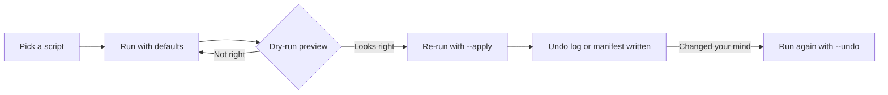

# python-automation-toolbox

20 standalone Python scripts that automate the boring parts of using a computer — file organizing, dedupe, batch images, PDFs, backups, QR codes, uptime checks, TTS. Each script is fully self-contained: its own argparse CLI, its own docstring, zero shared imports.


## Why

Everybody has a `scripts/` folder somewhere with half-finished automation. The scripts in this repo are the finished versions: the file organizer that actually has an undo log, the duplicate finder that quarantines instead of deleting, the backup script that rotates old archives instead of filling the disk. Copy one file, run it, done — there is no framework, no config system, no shared `utils.py` to drag along. Standalone is the feature.

Half the scripts are pure stdlib. The rest declare their one or two dependencies at the top of their docstring, so you never install more than the script you actually use.

## Design rules

Every script in this repo follows the same contract:



1. **Dry-run by default.** Anything that moves or renames files previews first; `--apply` is always explicit.
2. **Quarantine over delete.** Nothing in this repo ever deletes your data. Duplicates and stale downloads get *moved* — you do the deleting, deliberately, later.
3. **Undo logs.** File-moving scripts write a JSON log of every move and accept `--undo LOG` to reverse the whole run.
4. **Standalone.** Each script has its own argparse, its own docstring with three usage examples, and no imports from anywhere else in the repo.
5. **No API keys.** The weather and currency scripts use free no-signup APIs (Open-Meteo, Frankfurter). TTS uses edge-tts. The only optional config is a webhook URL for uptime alerts.

## Quickstart

```bash
git clone https://github.com/AleBrito124356/python-automation-toolbox
cd python-automation-toolbox
python -m venv .venv
.venv\Scripts\activate          # Windows   (Linux/macOS: source .venv/bin/activate)
pip install -r requirements.txt # or skip it: 11 scripts have no pip dependencies
cp .env.example .env            # only needed for uptime webhook alerts
```

Then run any script with `-h`:

```bash
python scripts/01_file_organizer.py -h
```

## The 20 scripts

| Script | What it does | Example |
|---|---|---|
| `01_file_organizer.py` | Sort a folder into type/date subfolders, undo log | `python scripts/01_file_organizer.py ~/Downloads --by type-date --apply` |
| `02_duplicate_finder.py` | Content dedupe: size prefilter + BLAKE2b, quarantines copies | `python scripts/02_duplicate_finder.py ~/Pictures --auto-keep-newest` |
| `03_bulk_rename.py` | Regex rename with preview table, `{n}` sequence, undo | `python scripts/03_bulk_rename.py ./photos --find "^.*$" --replace "trip_{n}" --apply` |
| `04_folder_backup.py` | Zip backups with keep-last-N rotation and manifest | `python scripts/04_folder_backup.py ~/projects ~/backups --keep 8 --exclude node_modules` |
| `05_image_batch.py` | Resize / convert / WebP / quality / strip EXIF, recursive | `python scripts/05_image_batch.py ./photos --out ./web --resize 1600 --format webp` |
| `06_pdf_tools.py` | Merge, split, rotate, extract page ranges | `python scripts/06_pdf_tools.py merge a.pdf b.pdf -o both.pdf` |
| `07_video_to_gif.py` | ffmpeg wrapper with two-pass palette for clean GIFs | `python scripts/07_video_to_gif.py demo.mp4 --fps 12 --width 480` |
| `08_csv_excel.py` | CSV ↔ xlsx with delimiter sniffing | `python scripts/08_csv_excel.py ventas.csv ventas.xlsx` |
| `09_disk_report.py` | Largest dirs and files with share-of-total bars | `python scripts/09_disk_report.py C:/Users/me --top 25` |
| `10_downloads_cleaner.py` | Archive files older than N days into dated categories | `python scripts/10_downloads_cleaner.py --days 60 --apply` |
| `11_wifi_qr.py` | Scan-to-join Wi-Fi QR, ASCII preview + PNG | `python scripts/11_wifi_qr.py --ssid "CasaBrito"` |
| `12_password_generator.py` | `secrets`-based passwords, pronounceable mode, entropy readout | `python scripts/12_password_generator.py --length 24 --count 5` |
| `13_qr_generator.py` | QR codes for URLs, text, and vCard contacts | `python scripts/13_qr_generator.py vcard --name "Ana Solis" --phone "+507 6000-0000"` |
| `14_uptime_checker.py` | Concurrent site checks from YAML, webhook alerts, loop mode | `python scripts/14_uptime_checker.py sites.yaml --loop 300` |
| `15_text_to_speech.py` | Text → MP3 with 300+ edge-tts neural voices, es/en | `python scripts/15_text_to_speech.py --file articulo.txt --voice es-MX-DaliaNeural` |
| `16_clipboard_watcher.py` | Clipboard history to JSONL with dedupe, Ctrl+C summary | `python scripts/16_clipboard_watcher.py --out snippets.jsonl` |
| `17_screenshot_tool.py` | Full / region / multi-monitor shots, interval timelapse | `python scripts/17_screenshot_tool.py --every 5 --count 120 -o timelapse/` |
| `18_weather_cli.py` | Forecast table via Open-Meteo, geocoding by city, no key | `python scripts/18_weather_cli.py "Panama City" --days 5` |
| `19_currency_converter.py` | ECB rates via Frankfurter, offline cache fallback | `python scripts/19_currency_converter.py 100 USD EUR` |
| `20_startup_auditor.py` | Windows autostart report: Run keys + Startup folders, read-only | `python scripts/20_startup_auditor.py --json` |

### Expected output, roughly

```text
$ python scripts/01_file_organizer.py ~/Downloads
  invoice_march.pdf     ->  Documents/invoice_march.pdf
  screenshot_441.png    ->  Images/screenshot_441.png
  node-v22.msi          ->  Installers/node-v22.msi

3 file(s) to move.
Dry-run only. Re-run with --apply to move files.

$ python scripts/19_currency_converter.py 100 USD EUR
100.00 USD = 91.85 EUR
Rate: 1 USD = 0.9185 EUR  (ECB date 2026-07-17)
```

## Safety notes

- **Nothing here deletes files.** `02_duplicate_finder` moves copies to `_duplicates_<timestamp>/` with a manifest; `10_downloads_cleaner` moves stale files to `Archive/`. The only exception is `04_folder_backup` rotating *its own* old zip files — never your data.
- **Dry-run is the default** for every destructive-ish operation (`01`, `03`, `10`). You must type `--apply`.
- **Undo logs** (`undo_*.json`, `rename_undo_*.json`, `cleaner_moves_*.json`) record every move and are consumed by `--undo`.
- `16_clipboard_watcher` writes clipboard contents to a local file. Don't run it while copying passwords.
- `20_startup_auditor` is read-only by design; it reports, you decide.

## Running on a schedule

The recurring ones (`04`, `10`, `14`) are built to be scheduled.

**Windows Task Scheduler** (run from an elevated prompt, adjust paths):

```bat
:: Weekly project backup, Sundays 20:00
schtasks /Create /SC WEEKLY /D SUN /ST 20:00 /TN "ToolboxBackup" ^
  /TR "py C:\tools\python-automation-toolbox\scripts\04_folder_backup.py C:\Projects D:\Backups --keep 8"

:: Monthly downloads cleanup, 1st of the month 09:00
schtasks /Create /SC MONTHLY /D 1 /ST 09:00 /TN "ToolboxDownloadsClean" ^
  /TR "py C:\tools\python-automation-toolbox\scripts\10_downloads_cleaner.py --days 30 --apply"
```

**cron** (Linux/macOS, `crontab -e`):

```cron
# Weekly backup, Sundays 20:00
0 20 * * 0  python3 ~/toolbox/scripts/04_folder_backup.py ~/projects ~/backups --keep 8

# Uptime check every 15 minutes (webhook alerts via UPTIME_WEBHOOK_URL in the environment)
*/15 * * * * python3 ~/toolbox/scripts/14_uptime_checker.py ~/sites.yaml

# Monthly downloads cleanup
0 9 1 * *   python3 ~/toolbox/scripts/10_downloads_cleaner.py --days 30 --apply
```

For always-on monitoring without cron, `14_uptime_checker.py sites.yaml --loop 300` in a tmux session or a service does the same job.

## Project structure

```text
python-automation-toolbox/
├── scripts/
│   ├── 01_file_organizer.py      ├── 11_wifi_qr.py
│   ├── 02_duplicate_finder.py    ├── 12_password_generator.py
│   ├── 03_bulk_rename.py         ├── 13_qr_generator.py
│   ├── 04_folder_backup.py       ├── 14_uptime_checker.py
│   ├── 05_image_batch.py         ├── 15_text_to_speech.py
│   ├── 06_pdf_tools.py           ├── 16_clipboard_watcher.py
│   ├── 07_video_to_gif.py        ├── 17_screenshot_tool.py
│   ├── 08_csv_excel.py           ├── 18_weather_cli.py
│   ├── 09_disk_report.py         ├── 19_currency_converter.py
│   └── 10_downloads_cleaner.py   └── 20_startup_auditor.py
├── examples/
│   └── sites.example.yaml        # config for 14_uptime_checker
├── .env.example                  # optional webhook URL, nothing else
├── requirements.txt              # union of deps; each script lists its own
├── LICENSE
└── README.md
```

## Adapt these

MIT-licensed on purpose: copy any script into your own project, rename it, strip the parts you don't need. The scripts are deliberately single-file so that "adapting" means editing one file, not vendoring a package. Attribution is appreciated, not required.

## Related projects

More repos from the same workshop:

- [pdf-power-tools](https://github.com/AleBrito124356/pdf-power-tools) — when `06_pdf_tools.py` isn't enough: one CLI for everything PDF, including compress, OCR, forms, and table extraction.
- [inbox-agent](https://github.com/AleBrito124356/inbox-agent) — email triage agent for your own inbox: IMAP fetch, classification, reply drafts. Drafts only, never auto-sends.
- [docker-compose-stacks](https://github.com/AleBrito124356/docker-compose-stacks) — copy-paste Compose stacks for a dev machine: databases, queues, monitoring, reverse proxy.
- [recetas-ia](https://github.com/AleBrito124356/recetas-ia) — 15 scripts prácticos de IA en español con la API gratuita de NVIDIA NIM, en el mismo espíritu de este repo.

## License

MIT © 2026 [Alejandro Brito](https://github.com/AleBrito124356)
